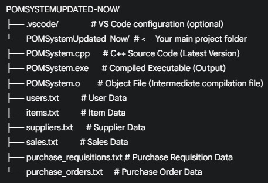
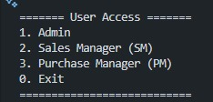
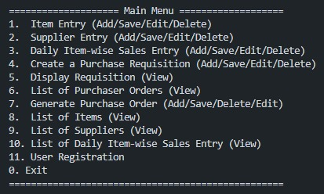
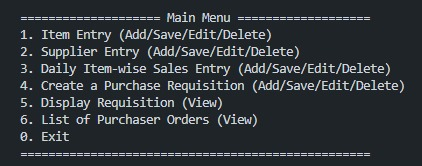
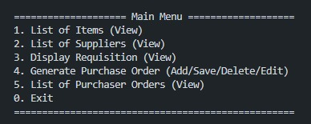

# Purchase Order Management System (POM System) - v3.0 Advanced Edition 🛒⚙️

Welcome to the **Advanced Edition** of the Purchase Order Management System (POM System)! This robust, console-based C++ application is meticulously designed to manage the complete lifecycle of users, items, suppliers, sales, purchase requisitions, and purchase orders. Version 3.0 elevates the system with enhanced precision, correctness, and reliability, all while maintaining straightforward data storage using text files.

## 🌟 Overview

This system provides a comprehensive suite of functionalities for managing the core aspects of a procurement workflow for TRANSYSLOGICS SDN BHD (TSB)[cite: 1, 2]. It employs strict role-based access control (Administrators, Sales Managers, Purchase Managers) and leverages plain text files (`.txt`) for transparent data persistence[cite: 12, 17, 20, 23, 29, 34]. This advanced version emphasizes secure data handling, sophisticated input validation, precise record management, and corrected core logic.

## ✨ Core Features

* **🛡️ Secure User Management:** Robust Login system and Administrator-exclusive User Registration with automatically generated, unique role-based IDs (`Admin1`, `SM1`, `PM1`, etc.)[cite: 14, 16, 17].
* **📦 Item Management:** Add, List, Edit (non-key fields: Name, Supplier ID), and Delete inventory items, ensuring referential integrity with suppliers[cite: 13, 18, 20].
* **🚚 Supplier Management:** Add, List, Edit (Name), and Delete supplier details, preventing duplicates[cite: 13, 21, 22]. (Simplified to focus on core supplier info).
* **📈 Advanced Sales Entry Management:**
    * Add daily sales records with automatic stock level updates (`Item::decreaseStock`)[cite: 13, 23, 71].
    * Generate **unique Sale IDs** (e.g., `S1`, `S2`) for each transaction[cite: 16].
    * List all sales entries, including their unique IDs.
    * **Precisely Edit** existing sales records (Quantity, Date) by targeting their unique `SaleID`[cite: 13, 60].
    * **Precisely Delete** specific sales records using their unique `SaleID`[cite: 13, 60].
* **📝 Purchase Requisition (PR) Management:**
    * Create PRs with automatic supplier fetching based on Item Code[cite: 28].
    * List, Edit (all fields except PRID), and Delete PRs[cite: 13, 25, 77].
    * Captures the requesting Sales Manager ID[cite: 29].
* **✅ Purchase Order (PO) Management:**
    * Generate POs from existing, validated PRs (PM only)[cite: 31, 33].
    * List, Edit (PRID, PM ID), and Delete POs[cite: 13, 34].
    * Captures the generating Purchase Manager ID[cite: 34].
* **🔐 Role-Based Access Control (RBAC):** Granular menus and permissions strictly enforced for `Admin`, `SM`, and `PM` roles[cite: 13, 60].
* **🔄 Streamlined Workflow:** Adding entries saves them directly to the respective file, enhancing efficiency[cite: 13].
* **📄 Data Persistence:** Utilizes easily accessible plain text files (`.txt`)[cite: 54].
* **✔️ Enhanced Validation:** Rigorous validation for numeric input, date formats (YYYY-MM-DD with range checks), duplicate primary IDs, and essential referential integrity (Items require valid Suppliers, PRs require valid Items/SMs, POs require valid PRs/PMs)[cite: 16, 20, 28, 29, 34, 36].
* **✍️ Robust Parsing:** Intelligently handles potential spaces in Item and Supplier names during listing and editing.
* **💾 Safe File Writes:** Employs a temporary file (`.tmp`) and rename strategy for all edit and delete operations, ensuring data atomicity and minimizing corruption risk during unexpected program termination.
* **🔑 Immutable Keys:** Guarantees data integrity by preventing modification of primary keys (UserID, ItemCode, SupplierCode, SaleID, PRID, POID) via Edit functions.

## 🛠️ Key Improvements in this Advanced Version

* **🎯 Precise Sales Management:** Introduction of unique `SaleID`s allows for accurate editing and deletion of specific sales records, moving beyond the previous first-match limitation.
* **🔗 Corrected Entity Relationships:** Simplified the `Supplier` class and file format, removing ambiguity and aligning with how item-supplier links are used operationally (via `items.txt`).
* **⚙️ Completed Edit Functionality:** All Edit functions (`editItem`, `editSupplier`, `editSaleEntry`, `editPR`, `editPO`) are now fully implemented with correct line-finding logic.
* **🐞 Bug Fixes:** Corrected the file writing destination bug in `editPR`. Ensured primary keys are non-editable.
* **🛡️ Robust File I/O & Input:** Retained comprehensive checks for file operations and user input validation from the previous robust version.
* **⚡ Streamlined Workflow:** Maintained the direct save-on-add approach for user efficiency.

## 📁 File Structure

*(Visual representation - ensure 'assets/Structure.jpg' exists and is accurate)*


**Crucially:** The `POMSystem.exe` program requires the `.txt` data files to be located in the *exact same directory* from which it is executed.

## 💾 Data File Formats (Advanced Edition)

The system uses space-separated values. Ensure these files exist (can be empty) before the first run.

* **`users.txt`**
    * **Format:** `UserID Password AccessLevel`
    * *Example:* `Admin1 securePass Admin`
    * *Note:* UserID is generated. Login is case-sensitive.
* **`items.txt`**
    * **Format:** `ItemCode ItemName SupplierCode QuantityInStock`
    * *Example:* `ITM001 Fresh Milk 1L SUP001 150`
    * *Note:* `ItemName` handles spaces. `QuantityInStock` is updated by sales/receiving (receiving not implemented in this scope).
* **`suppliers.txt`**
    * **Format:** `SupplierCode SupplierName`
    * *Example:* `SUP001 F&N Holdings Berhad`
    * *Note:* Simplified format. `SupplierName` handles spaces.
* **`sales.txt`**
    * **Format:** `SaleID ItemCode Quantity SalesDate`
    * *Example:* `S1 ITM001 5 2025-04-14`
    * *Note:* `SaleID` is unique and automatically generated (e.g., S1, S2...). Edit/Delete targets this ID.
* **`purchase_requisitions.txt`**
    * **Format:** `PRID ItemCode Quantity RequiredDate SupplierCode SalesManagerID`
    * *Example:* `PR001 ITM001 50 2025-05-01 SUP001 SM1`
    * *Note:* `SupplierCode` is fetched automatically during PR creation/edit based on `ItemCode`.
* **`purchase_orders.txt`**
    * **Format:** `POID PRID PurchaseManagerID`
    * *Example:* `PO001 PR001 PM1`

## 🚀 How to Compile and Run

1.  **Prerequisites:** A C++ compiler supporting C++11 or later (e.g., g++, Clang++, MSVC).
2.  **Save Code:** Save the complete C++ source code as `POMSystem.cpp`.
3.  **Data Files:** Ensure all required `.txt` files (`users.txt`, `items.txt`, `suppliers.txt`, `sales.txt`, `purchase_requisitions.txt`, `purchase_orders.txt`) are present in the same directory as the source code. They can be initially empty.
4.  **Initial User:** Manually add at least one user (preferably an Admin) to `users.txt` to enable login. Example: `Admin1 yourpassword Admin`
5.  **Open Terminal/Command Prompt:** Navigate (`cd`) to the directory containing `POMSystem.cpp` and the `.txt` files.
6.  **Compile:**
    ```bash
    g++ POMSystem.cpp -o POMSystem.exe -std=c++11 -Wall -Wextra -pedantic
    ```
    *(Using `-Wall -Wextra -pedantic` is recommended for catching potential issues).*
    *(Address any compilation errors.)*
7.  **Run:**
    * Windows: `.\POMSystem.exe`
    * Linux/macOS: `./POMSystem.exe`
8.  **Interact:** Follow the on-screen menu prompts.

## 🔑 Login Process

The application initiates with the User Access selection:




1.  Select the role number (1, 2, or 3).
2.  Enter the corresponding UserID and Password when prompted. **Credentials are case-sensitive.**
3.  The system authenticates against `users.txt`.
4.  Successful login displays the menu tailored to the user's role.
5.  Failed login shows an error and returns to role selection.

## 👥 User Roles and Access Control (Summary)

*(Ensure images 'assets/AdminMenu.jpg', 'assets/SalesManagerMenu.jpg', 'assets/PurchaseManagerMenu.jpg' accurately reflect the menus in the code)*

* **`Admin`**: Unrestricted access to all data management functions (Items, Suppliers, Sales, PRs, POs) + User Registration.
* 
    
* **`SM` (Sales Manager)**: Manages Items, Suppliers, Sales, and PRs (full CRUDL). Can only *view* POs.
* 
    
* **`PM` (Purchase Manager)**: Manages POs (full CRUDL). Can only *view* Items, Suppliers, and PRs.
* 
    

## ⚠️ Notes / Limitations

* **Concurrency:** This application is designed for **single-user operation only**. Concurrent execution attempting file modifications will lead to unpredictable results and likely data corruption.
* **Scalability:** File searching relies on sequential reading. Performance will degrade significantly with very large datasets. A database solution is recommended for larger-scale deployments.
* **Advanced Relationships:** While basic referential integrity is checked (e.g., item needs existing supplier), complex database features like cascading deletes/updates or enforcing strict one-to-many/many-to-many relationships across files are not implemented.
* **Parsing Assumptions:** While Item/Supplier names handle spaces, parsing for multi-field lines (like PRs) assumes other fields do not contain spaces.

## 📜 License

Distributed under the MIT License. See `LICENSE` file for more information.

*(If this was purely an academic assignment without intent for broader use, you might state "Educational Purposes Only")*

---

## 👤 Author

* **Pedro Fabian Owono** - [Owono2001](https://github.com/Owono2001)

---

<div align="center">
  <em>Happy Coding & Managing Inventory!</em>
</div>

---
